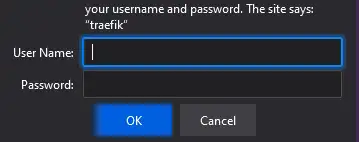

# Basic auth


Without any authentication all ingresses are unprotected, unless they offer their own auth. One easy way to add some security to this is using basic auth. This wil also allow us to secure the private registry easily if we use one. All with the same credentials. See the [docs](https://doc.traefik.io/traefik/middlewares/basicauth/) for more details.

## Credentials
```bash 
cat basic-auth-secret.yaml | envsubst | kubectl apply -f -
```

## Middleware
```bash 
cat basic-auth-middleware.yaml | envsubst | kubectl apply -f -
```

## Add Middleware to the traefik Ingressroute
```bash 
cat traefik-ingressroute.yaml | envsubst | kubectl apply -f -
```

## Test it  
Access <a href="https://traefik.yourdomain.com" target="_blank">https://traefik.yourdomain.com</a> and see that it now needs username and password. The combination is test/test.

## Rotate credentials (Optional but smart)
These credentials may not be the best, so lets try to rotate them.  
```bash
htpasswd -c mynewcreds user1
# enter and reenter password
htpasswd mynewcreds user2
#enter and reenter password
htpasswd mynewcreds user3
#enter and reenter password*
cat mynewcreds | base64 > mynewcreds64
cat <<EOF | kubectl apply -f -
apiVersion: v1
kind: Secret
metadata:
  name: my-basic-auth-secret
  namespace: default
data:
  users: |2
    $(head -1 mynewcreds64 | tail -1)
    $(head -2 mynewcreds64 | tail -1)
    $(head -3 mynewcreds64 | tail -1)
EOF
```

