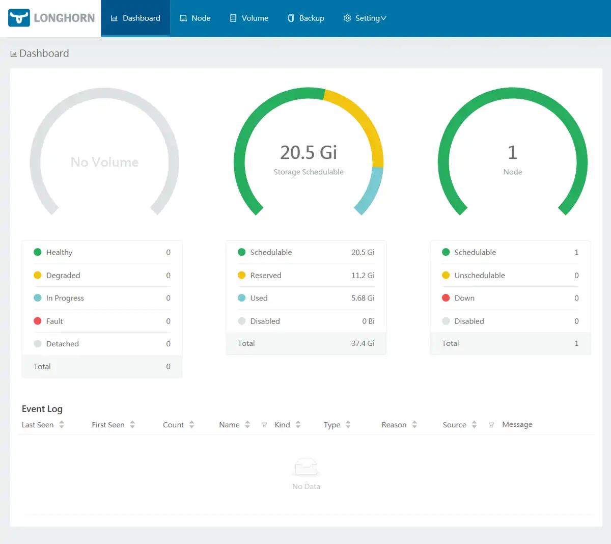

# Persistant storage with localstorage and longhorn

See [k3s storage docs](https://rancher.com/docs/k3s/latest/en/storage/) for more documentation.

Below we will show two options. **Local storage** and **distributed storage**. That just means using the local storage on the node where it is running. On a single machine this is of course not a problem, but it can cause problems if you have a permanent failure of a node in a cluster, where you of course will suffer data loss. On a distributed storage on the other hand, you can make sure that the data is replicated on multiple nodes, and in that case a single node failure would be no problem.

## Local storage

### Local storage PVC

```bash
cat pvc-ghost-localstorage.yaml | envsubst | kubectl apply -f -
```

<details>
<summary>pvc-ghost-localstorage.yaml</summary>
```
--8<-- "./manifests/pvc-ghost-localstorage.yaml"
```
</details>

### Ghost with persistant local storage

```bash
cat ghost-localstorage.yaml | envsubst | kubectl apply -f -
```

<details>
<summary>ghost-localstorage.yaml</summary>
```
--8<-- "./manifests/ghost-localstorage.yaml"
```
</details>

## Distributed storage (Longhorn)
  
### Setting up Longhorn

Apply the `longhorn.yaml` to install Longhorn
```bash
kubectl apply -f https://raw.githubusercontent.com/longhorn/longhorn/master/deploy/longhorn.yaml
```
Longhorn will be installed in the namespace `longhorn-system`.

### Longhorn PVC

```bash
cat pvc-ghost-longhorn.yaml | envsubst | kubectl apply -f -
```

<details>
<summary>pvc-ghost-longhorn.yaml</summary>
```
--8<-- "./manifests/pvc-ghost-longhorn.yaml"
```
</details>

### Ghost with Longhorn distributed storage

- first delete ghost

```bash
cat ghost-localstorage.yaml | envsubst | kubectl delete -f -
```

- And then recreate it with longhorn

```bash
cat ghost-longhorn.yaml | envsubst | kubectl apply -f -
```

## Longhorn UI

```bash
cat longhorn-ui-ingress.yaml | envsubst | kubectl apply -f -
```

<details>
<summary>longhorn-ui-ingress.yaml</summary>
```
--8<-- "./manifests/longhorn-ui-ingress.yaml"
```
</details>

Your longhorn UI should now be accessible at <a href="https://longhorn.dog.example.com" target="_blank">https://longhorn.dog.example.com</a>

