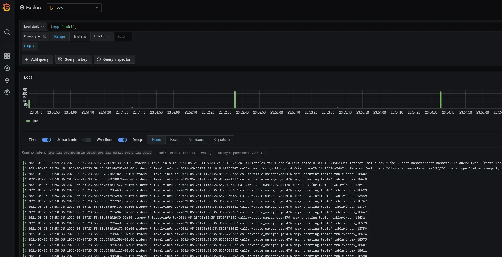

## Logging
Since we already are relying on grafana for metrics, it is conveniant to use Loki for logging.


### Install loki
```bash
helm repo add grafana https://grafana.github.io/helm-charts && \
helm repo update && \
helm upgrade --install loki grafana/loki-stack  
```

### Add Loki as datasource
The helm chart installation should? have added loki as a datasource to grafana, but in case it is not there, we have two alternatives. 

#### 1. Add it manually in the grafana UI
Configuration > "Add Datasource" > Loki > "url: http://loki:3100" > "Save & Test"  
#### 2. Add it using a configmap
* Add the configmap
```bash
kubectl apply -f loki-datasource.yaml
```
* Restart the deployment
```bash
kubectl rollout restart deployment prometheus-stack-grafana
```


Go to "Explore" > "Loki" to start exploring  
