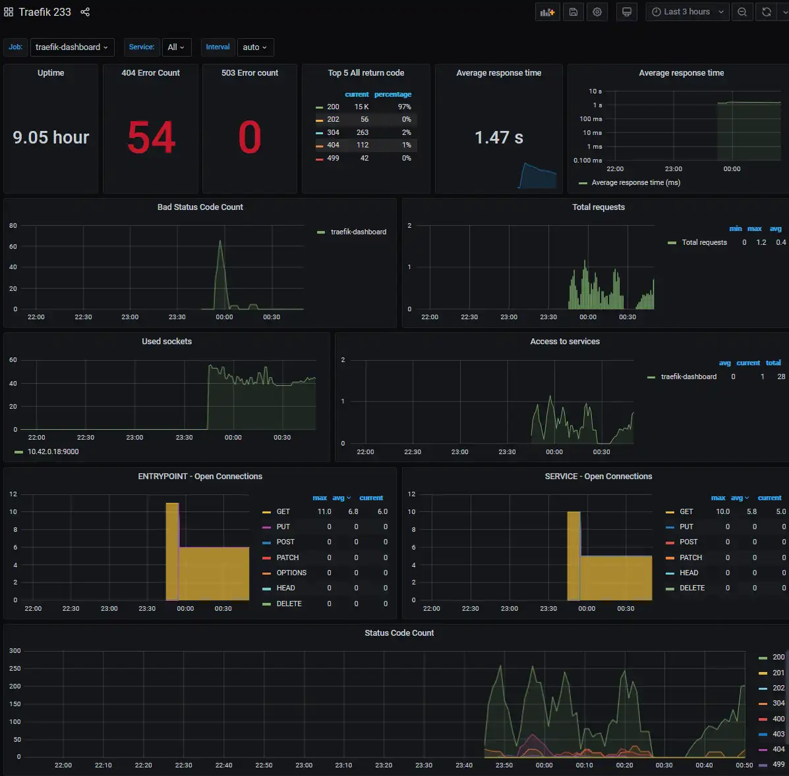

# Metrics


## Install helm chart
For settings see:
[Helm Chart Values](https://github.com/prometheus-community/helm-charts/blob/kube-prometheus-stack-16.0.1/charts/kube-prometheus-stack/values.yaml)


## Prometheus-community stack
* Add and update the prometheus-community repo
```bash
helm repo add prometheus-community https://prometheus-community.github.io/helm-charts && \
helm repo update
```
* Install / Deploy it with helm
```bash
# For new install
helm install prometheus-stack --version 16.0.1 -f prometheus-values.yaml prometheus-community/kube-prometheus-stack
```
```bash
# Or e.g. after updating values
helm upgrade prometheus-stack --version 16.0.0 -f prometheus-values.yaml prometheus-community/kube-prometheus-stack
```

## Ingresses
* Alertmanager (alert-manager.dog.example.com)
```bash
cat alert-manager-ingress.yaml | envsubst | kubectl apply -f -
```
* Prometheus (prometheus.dog.example.com)
```bash
cat prometheus-ingress.yaml | envsubst | kubectl apply -f -
```
* Grafana (grafana.dog.example.com)
```bash
cat grafana-ingress.yaml | envsubst | kubectl apply -f -
```

## Traefik service monitor
```bash
cat traefik-service-monitor.yaml | envsubst | kubectl apply -f -
```

## Traefik dashboard service
```bash
cat traefik-dashboard-service.yaml | envsubst | kubectl apply -f -
```

## Traefik grafana dashboard
```bash
kubectl apply -f traefik-dashboard.yaml
```

## Done 
* Check alert-manager, prometheus or grafana to see how it looks
<a href="http://grafana.dog.example.com" target="_blank">http://grafana.dog.example.com</a>