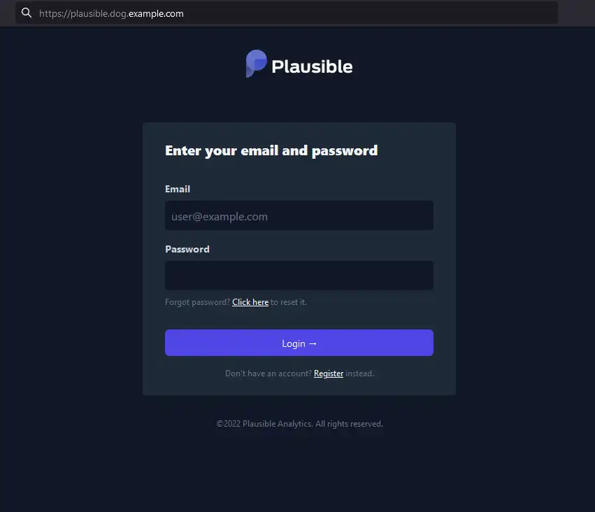

# Plausible analytics

Create a security key

```bash
export PLAUSIBLE_SECRET_KEY_BASE=$(openssl rand -base64 64 | tr -d '\n' ; echo)
```

Set the other variables (please replace them as appropriate for you)

```bash
export PLAUSIBLE_POSTGRES_USER=mypostgresuser && \
export PLAUSIBLE_POSTGRES_PASSWORD=mypostgrespassword && \
export PLAUSIBLE_ADMIN_USER_EMAIL=my@email.com && \
export PLAUSIBLE_ADMIN_USER_NAME=myadminusername && \
export PLAUSIBLE_ADMIN_USER_PWD=mysecretadminpassword
```

Apply the manifest with envsubst

```bash
cat plausible-localstorage.yaml | envsubst | kubectl apply -f -
```

<details>
<summary>plausible-localstorage.yaml</summary>
```
--8<-- "./manifests/plausible-localstorage.yaml"
```
</details>

This should result in something like this:

```bash
persistentvolumeclaim/plausible-clickhouse-pvc created
persistentvolumeclaim/plausible-postgres-pvc created
service/plausible-postgres created
deployment.apps/plausible-postgres created
service/plausible-mail created
deployment.apps/plausible-mail created
service/plausible-clickhouse created
deployment.apps/plausible-clickhouse created
configmap/plausible-clickhouse-config created
configmap/plausible-clickhouse-user-config created
service/plausible created
deployment.apps/plausible created
ingress.networking.k8s.io/plausible-ingress created
```

And your plausible instance should now be accessible at <a href="https://plausible.dog.example.com" target="_blank">https://plausible.dog.example.com</a>

