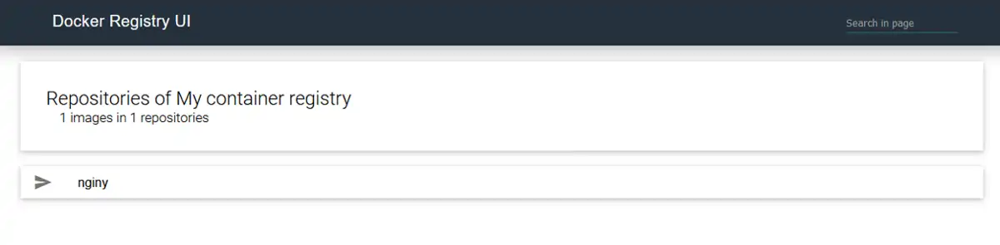

# Private container registry

## Using private registry

Using a registry besides docker hub, requires us to create a file on each node that should access it. (Usually every node)  
[rancher docs](https://rancher.com/docs/k3s/latest/en/installation/private-registry/)

Since the registry will require inputting values into a file on each server, it could be a good idea for it to have its own credentials.

- Install htpasswd if you do not have it

```bash
apt install apache2-utils -y
```

## Create the secret

```bash
# You should replace the username and password with more secure ones
export REGISTRY_USERNAME=username
export REGISTRY_PASSWORD=password
cat <<EOF | kubectl apply -f -
apiVersion: v1
kind: Secret
metadata:
  name: registry-basic-auth-secret
  namespace: default
data:
  users: |2
    $(htpasswd -bn $REGISTRY_USERNAME $REGISTRY_PASSWORD | base64)
EOF
```

```bash
cat <<EOF > /etc/rancher/k3s/registries.yaml
mirrors:
  registry.${DOMAIN}:
    endpoint:
      - "https://registry.${DOMAIN}"
configs:
  "registry.${DOMAIN}":
    auth:
      username: ${REGISTRY_USERNAME}
      password: ${REGISTRY_PASSWORD}
EOF
# check to see
cat /etc/rancher/k3s/registries.yaml
```

- Restart K3S for this to take effect

```bash
systemctl restart k3s
```

## Alternatively

You can add a secret like this and add it to the deployment

```bash
kubectl create secret docker-registry my-private-registry \
--docker-server=registry.${DOMAIN} \
--docker-username="username" \
--docker-password="password" \
--docker-email=something@randomhere.com
```

```yaml
apiVersion: apps/v1
kind: Deployment
metadata:
  name: system-info-web
spec:
  selector:
    matchLabels:
      app: system-info-web
  replicas: 1
  template:
    metadata:
      labels:
        app: system-info-web
    spec:
      containers:
      - name: system-info-web
        image: registry.${DOMAIN}/system-info-web:latest
        ports:
        - containerPort: 8000
      imagePullSecrets:
      - name: secret-docker
```

### Then create the middleware

```bash
cat basic-auth-registry-middleware.yaml | envsubst | kubectl apply -f -
```

We are planning to use a simple registry-ui for the registry. That requires us to use a cors middleware. This could be done in the registry settings as well, but its convenient to use the traefik ingress to solve this.

```bash
cat registry-cors-middleware.yaml | envsubst | kubectl apply -f -
```

Then we create the registry service with cors middleware. Authentication is handled by the registry auth. (We could optionally add basic auth on the UI itself, but it would require us to enter two sets of credentials. One for the UI and one for the registry)

```bash
cat registry-ephemeral.yaml | envsubst | kubectl apply -f -
```

Finally the registry-ui (optional)

```bash
cat registry-ui.yaml | envsubst | kubectl apply -f -
```


For the registry UI, we will use the same basic auth middleware as for the registry, as the registry-ui forwards the credentials. If you use a different basic auth middleware here then you will best case have to enter two sets of credentials. So its better to just have the same as the registry.

## Test the registry

On any machine with docker:

```bash
docker login registry.${DOMAIN}
# Username: username
# Password: password
# (The registry credentials)
```

```bash
docker pull nginx:latest
```

```bash
docker tag nginx:latest registry.dog.example.com/nginy:later
```

```bash
docker push registry.dog.example.com/nginy:later
```

```bash

The push refers to repository [registry.mydomain.com/nginy]
f0f30197ccf94: Pushed
e23424ff930d4: Pushed
c9732d7567184: Pushed
4b8db2d43325a: Pushed
4312341684c4a: Pushed
02c055fgh42f5: Pushed
latest: digest: sha256:eba373a0620f68ffdc3f4327041ad25e2342175b8feb35b992574cd83698e9e3c size: 1570
```

## Add persistance

If everything looks allright you might want to consider adding some persistance to that registry.

- Delete the ephememeral deployment/service/ingress

```bash
cat registry-ephemeral.yaml | envsubst | kubectl delete -f -
```

- Create the longhorn (or localhost) PVC

```bash
cat pvc-registry-longhorn.yaml | envsubst | kubectl apply -f -
```

- Create the longhorn (or localhost) deployment/service/ingress

```bash
cat registry-longhorn.yaml | envsubst | kubectl apply -f -
```

## Build, push and deploy to the registry
### Install docker
- Install Docker following <a href="https://docs.docker.com/install/" target="_black">the official guide</a>...
- ...or alternatively, run the official convenience script:

```bash
# Download Docker
curl -fsSL get.docker.com -o get-docker.sh
# Install Docker using the stable channel (instead of the default "edge")
CHANNEL=stable sh get-docker.sh
# Remove Docker install script
rm get-docker.sh
```

### Build the container
* Go the the /apps/system-info-web folder
```bash
cd ../apps/system-info-web/
```

* Build the container
```bash
docker build -t registry.${DOMAIN}/system-info-web .
```

* Push the container
```bash
docker push registry.${DOMAIN}/system-info-web
```

* Deploy it
* Go back to the manifests folder if neccesary
```bash
cd ../../manifests
```
* Deploy
```bash
cat system-info-web.yaml | envsubst | kubectl apply -f -
```

### Check
Go to <a href="http://sysinfo.dog.example" target="_blank">http://sysinfo.dog.example</a> To see if it has worked.


**Note:** See the value under __"hostname"__ which is the name of the pod running the service. In the deployment yaml it has been specified with 2 replicas. Try refreshing and see that this value will change as the ingress is now load balancing between the two replicas. 