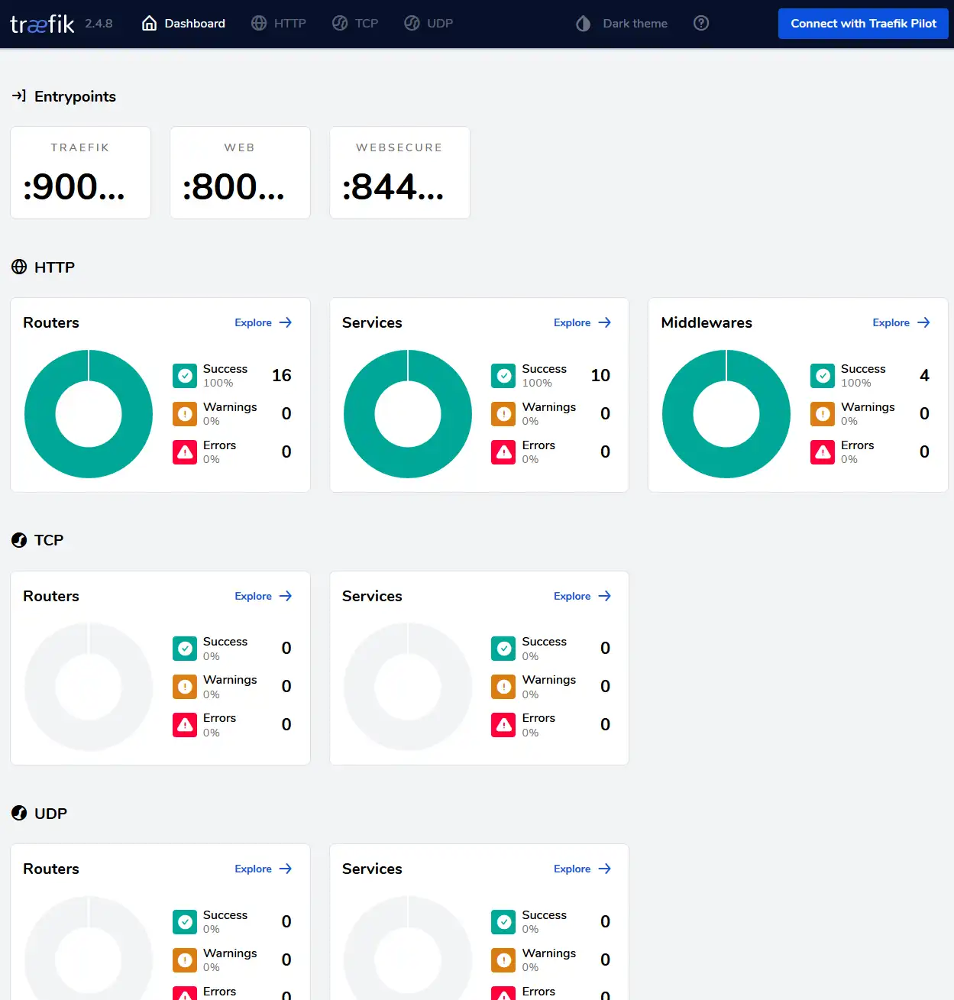

# Traefik dashboard



## Expose traefik dashboard
You can use both Kubernetes standard Ingress or the Traefik CRD ingressroute for normal routes. To expose the dashboard I have found no other way than to use the ingressroute CRD. When using this combined with with global redirect to https you might need a https certificate first

#### Create https certificate for ingressroute
Traefik does not support using cert-manager for tls. So when using ingressroute with https you need to first create a "fake" ingress to get a secret with the desired name. Then you use that secret like below. 

> __Wildcard:__ Alternatively you could get a wildcard certificate, and just use that. The setup for that is slightly more complicated and might require using a third party nameserver like digitalocean or cloudflare to help with the challenges. 

* Create the temporary ingress so cert-manager gets the intial certificate
```bash 
cat traefik-dashboard-tmp-ingress.yaml | envsubst | kubectl apply -f -
```
* Wait until you are able to access <a href="https://traefik.dog.example.com" target="_blank">https://traefik.dog.example.com</a> without errors or warnings about certificate.
* Then delete it
```bash
cat traefik-dashboard-tmp-ingress.yaml | envsubst | kubectl delete -f -
```
* Finally create the traefik native ingressroute
```bash
cat traefik-ingressroute-no-auth.yaml | envsubst | kubectl apply -f -
```

# Done
Now you should have the traefik dashboard available on <a href="https://traefik.dog.example.com" target="_blank">https://traefik.dog.yourdomain.com</a>